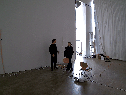
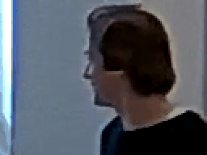

# Log

This is a daily log, where aims and ideas for a day are formulated and reviewed.

## Backlog
- refactor Track, to more modal design
- create physical controller model
- fix smoother bugs:
   1. add kalman smoother for every trackId
   2. apply world coordinates to kalman filter
- write expressions
- research node and eyes position to determinate face direction

## Logs

### 29 -- Mo 21. Maerz
1. verschiedene Befehle orchestrieren
   1. totale
   2. muster fuß bis kopf oder körper scan
   3. einzelne körperteile verfolgen: hände
   4. zoom auf augen, nase

---

### 28 -- Sa 19. Maerz
### 27 -- Fr 18. Maerz
### 26 -- Do 17. Maerz
### 25 -- Mi 16. Maerz

#### Reflection 
I totaly sucked, I lost focus from the imported stuff, to be prepared for the probeaufbau week and get lost in details, about pysical movement models

### 24 -- Di 15. Maerz
1. verschiedene Befehle orchestrieren
   1. totale
   2. muster fuß bis kopf oder körper scan
   3. einzelne körperteile verfolgen: hände
   5. zoom auf augen, nase
	
#### DONE
1. part
   1. Done

zoom movement

fixed movement bind to time_delta not frames

---

### 23 -- Mo 14. Maerz
1. fasten up, make one detection run and save results for later load
   1. serialize results
   2. create doubles that load results
2. set zoom appropriated to face size (bounds of landmarks * 2)
   1. create model
   2. quess zoom

#### DONE
?

---

### 22 -- Fr 11. Maerz
1. fasten up, make one detection run and save results for later load
   1. serialize results
   2. create doubles that load results
2. set zoom appropriated to face direction and size
   1. create model
   2. quess zoom

DONE 
refactoring and video_stepper.py creation

---

### 21 -- Do 10. Maerz
1. integrate it into run_pipeline
2. set zoom appropriated to face direction and size
   1. extract example images for different head directions
   2. analyse pose data
   3. create model
   4. quess zoom

#### DONE
1. done
2. part
   1. done
   2. done

movement limited by static velocity 

---

### 20 -- Mi 09. Maerz
1. make physical model cam control class
2. integrate it into run_pipeline

#### DONE
1. done

---

### 19 -- Di 08. Maerz
1. fix error on out if image zoom position
2. make physical model cam control class

#### DONE
1. done

increased length, so we have more people jumps

calculate_newest_track_id

calculate_oldest_track_id

---

### 18 -- Mo 07. Maerz
1. make docu script that creates gif of current state

#### DONE
1. done

\
calculate_oldest_track_id

---

### 17 -- So 06. Maerz
#### Objects
1. refactor Track, to more modal design
   1. make pose estimation class
   2. make camera position class

#### DONE 
1. done
   1. done
   2. done

---

### 16 -- Mi 02. Maerz
#### Objects
1. create basic app structure with or real code
   1. reduce object detection to essence
      1. make it OOP
   2. make object detection in memory double
   3. make pose estimation class
   4. make pose estimation in memory double
   5. make camera position class
   6. pseudo code
   7. define interfaces for modules

#### DONE 
1. part
   1. part
      1. DONE
   
---

### 15 -- Di 01. Maerz
#### Objects
1. create basic app structure with or real code
   1. reduce object detection to essence
      1. clean up
      2. make it OOP
   2. pseudo code
   3. define interfaces for modules

#### DONE
1. part
   1. part
      1. DONE

---

### 14 -- Mo 28. Feb
#### Objects
1. revert to ubuntu 20.04
2. create basic app structure with or real code
   1. pseudo code
   2. define interfaces for modules

#### DONE
1. done

---

### 13 -- Do 24. Feb
### 12 -- Mi 23. Feb

#### DONE
destoyed my system, and ordered a new PC, with financial support by karin

---

### 11 -- Di 22. Feb

#### Objects
1. make a KW plan
2. try mediapipe
   1. compile with gpu and test example
      1. compile opencv2 by hand
      2. test example
      3. compile python bindings and test
      4. compare speed
3. create basic app structure with or real code
   1. pseudo code
   2. define interfaces for modules

#### DONE
2. mediapipe compilation freezes my system, i was trying to fix it rest of the week

---

### 10 -- Mo 21. Feb

#### Objects
1. try mediapipe
   1. compile with gpu and test
      1. compile opencv2 by hand
  
#### DONE
1. DONE, was okay with 15fps aka 70ms runtime, maybe it will be better if it's compiled with GPU/Cuda support

---

### 09 -- Sa 19. Feb

#### Objects
1. ~~try AlphaPose~~
  
#### DONE
1. DONE, was not so good, was not stable and just 8 fps

---

### 08 -- Fr 18. Feb

#### Objects
1. implement view controll
   1. with fixed zoom, just controlles by (x,y)
2. integrate smooter into view controll
3. ~~create physical controller model~~
4. ~~fix smoother bugs:~~
   1. ~~add kalman smoother for every trackId~~
   2. ~~apply world coordinates to kalman filter~~

#### DONE
1. DONE, uglq but works
2. DONE

---

### 07 -- Do 17. Feb

#### Objects
1. add 2. Order Filter
2. ~~implement view controll~~
3. ~~integrate smooter into view controll~~
4. ~~create physical controller model~~

#### DONE
1. Done (before i updated this file)

#### Reflection
i was so obsessed to fix the kalman bad results that i didn't caught the objects 2.- 4.
---

### 06 -- Mi 16. Feb

#### Objects
1. apply kalman filter to smooth

opt
2. run detection and store result
3. run pose and store result

#### DONE
1. nice results
---

### 05 -- Di 15. Feb

#### Objects
1. create an app that reads video and display it
2. show pose detections on vi
3. apply kalman filter to smooth

opt
4. run detection and store result
5. run pose and store result

#### DONE
1. Done
2. Done
3. created prototype in lab/2d/py

#### Reflection 
was a good day, i accomplished a good batch of stuff
i'm looking forward for tomorrow to finish kalman smoothining and intigrate it into my code

---

### 04 -- Mo 14. Feb

#### Objects
1. create an app that reads video and display it

opt
2. run detection and store result
3. run pose and store result

#### DONE

1. took Yolo5 and just inserted movenet, for fast prototyping 

---

### 03 -- Fr 11. Feb

#### Objects
1. Make a timetable till end of next week
2. define interfaces of app parts

opt
3. create an app that reads video and display it

#### DONE
nothing finished, was not focused and later interrupted by familie

---

### 02 -- Do 04. Feb

#### Objects
1. decide how video playback is made,
    a. images are shown after the camera position is calculated by the pipeline
    b. images are shown as they arrise, and position is delayed
    c. or implemenmt both possibilities

2. decide which concurrency model to use
    https://realpython.com/python-concurrency/

3. create an app that reads video and display it

4. build a prototype of "image -> box detection -> pose estimation -> camera position -> image" pipeline

#### Ideas
- implement playback with gstreamer, it a little work but maybe we can use it @see 2021_Diplom/2021_Diplom_Lab/google-coral/examples-camera/gstreamer/detect.py

#### Done
1. I choose a. for now, its good enough for now, later I can implemenmt it other wise
2. is obsolet cause of 1.

canceled at 13:30 cause M is not sleeping, so I go support P

#### Review 11.02.2022
3. defer 
4. defer 
cause its 

---

### 01 -- Di 02. Feb / Mi 03. Feb

#### Objects
make basic technic run, pose detection, box detection

#### Done 
all

#### Review 
the objects where backdated formualted, so it's not a real review, but anyway we have a good state

---

